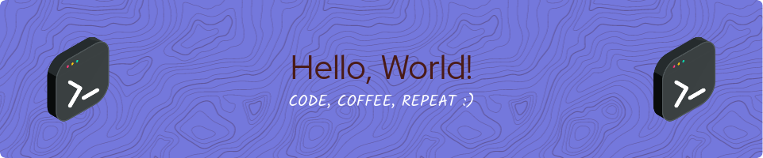

[//]: # (This may be the most platform independent comment)

<h1 align="center">Hi there👋, I'm Viswajith J</h1>
<h3 align="center">A coding enthusiast/student on a journey to explore the world of technology.</h3>  

- 🌱 I’m currently learning **Cybersecurity Fundamentals and Web-development**

- 👯 I’m looking to collaborate on **Python projects**

- 🌟 I'm interested in **Web-dev, App-dev, and Cyber Security**

- 🤝 I’m looking for help with **Cybersecurity**

- 📫 How to reach me **viswajith.j.official@gmail.com**

- ⚡ Fun fact : **"Fun?! Wot's that"**

<h3 align="left">Connect with me:</h3>

<!---->
<!---->
<!---->

<h3 align="left">Languages and technologies:</h3>

<h3 align="left">Tools:</h3>

<!--

        

-->

<!--

        

          -->

<!--

-->

